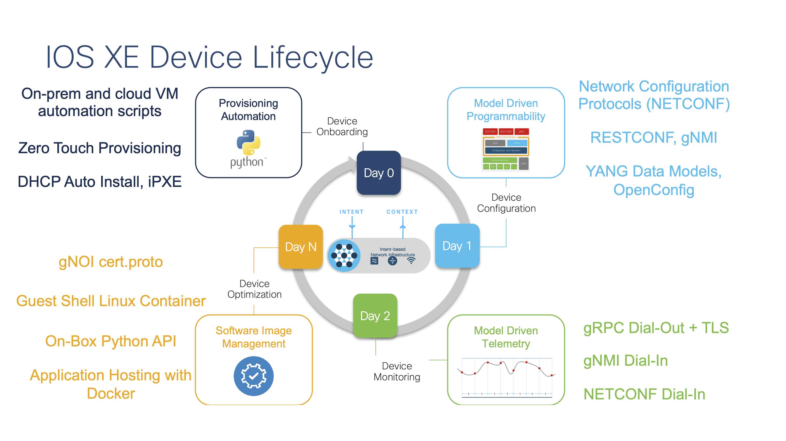
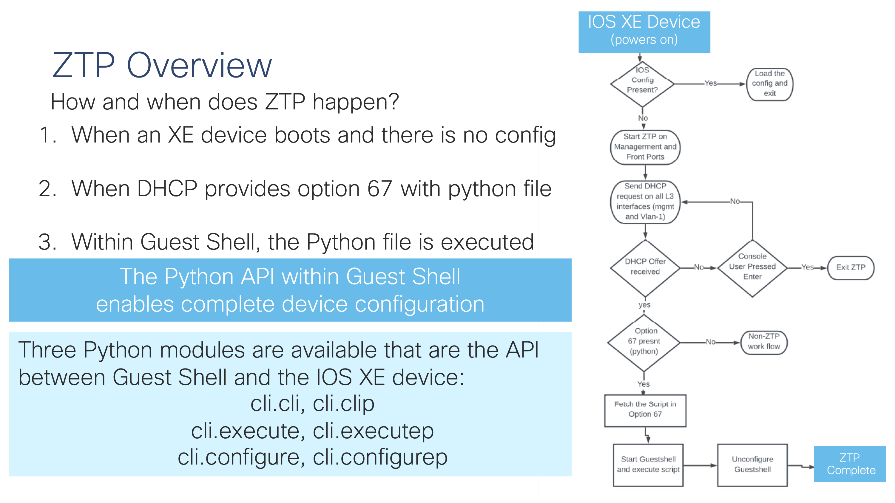

# Introduction to ZTP

The Zero Touch Provision solution fits within the **Day 0 - Device Onboarding** part of the IOS XE device lifecycle. It's function is to onboard network devices to the network. There are components from **Day N - Device Optimzation** specifically the Python API and the Gueset Shell Linux Container that are leveraged as part of the ZTP feature. There are other labs that focus more on Guest Shell and the Python API, as well as on the Day 1 and Day 2 features that are not covered as part of this lab.

## What is ZTP ?

Zero Touch Provision, or ZTP, is part of the **Day 0** device programmability ecosystem which enables network operators to provision network device more programmatically. Using a combiation of DHCP, Python, and the Linux Guest Shell container, the ZTP feature is used to fully configure the device automatically during it's initial boot.

When a device that supports Zero-Touch Provisioning boots up, and does not find the startup configuration (during initial installation), the device enters the Zero-Touch Provisioning mode. 

The device searches for an IP from a DHCP server and bootstraps itself by enabling the Guest Shell Linux container. The device then obtains the IP address or URL of the HTTP or TFTP server, and downloads a Python script from the server to configure the device.

# Demo Recordings
1) 16.10 to 16.8 to 16.9 upgrade: https://youtu.be/J5pp4ts13F4
